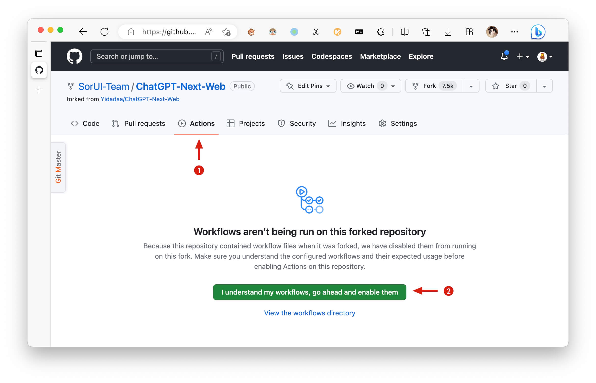

<div align="center">

<h1 align="center">qunqinChat</h1>

[English] / [简体中文](./README_CN.md)

✨ 无广告版NextChat - 轻量、快速的AI助手，支持Claude、DeepSeek、GPT4和Gemini Pro。

</div>

## 项目介绍

qunqinChat是一个基于[NextChat](https://github.com/Yidadaa/ChatGPT-Next-Web)的修改版本，主要改进：

- **移除了所有广告内容**：提供更纯净的用户体验
- **修改了界面文本**：使文本更加简洁友好和专业
- **保留了原版全部功能**：支持多种AI模型，同时具备轻量化、快速的特点
- **提供Docker镜像**：一键部署，方便所有人使用

## 主要修改内容

1. **移除广告文本**：
   - 将错误提示信息从"😆 对话遇到了一些问题，不用慌"修改为"😊 欢迎使用NextChat，请先完成以下设置"
   - 将"使用 NextChat AI"改为"开始使用 NextChat"
   - 将"（性价比最高的方案）"改为"（快速启动选项）"
   - 将详细描述文本改为简单的"简单配置，快速开始，支持多种AI模型"
   - 移除了顶部广告文本"🥳 NextChat AI 首发优惠..."，改为简单的"欢迎使用 NextChat"

2. **移除广告按钮**：
   - 从settings.tsx文件中移除了"开始对话"按钮
   - 从auth.tsx文件中移除了"开始对话"链接

3. **增强用户体验**：
   - 添加了密码保护功能示例配置
   - 优化了整体界面，使其更加简洁清晰

## 使用Docker镜像

qunqinChat提供了官方Docker镜像，可以通过以下方式使用：

### 方法1：使用Docker命令

```bash
# 拉取镜像
docker pull qweabc123456/qunqinchat:latest

# 运行容器
docker run -d -p 3000:3000 -e CODE=your_password qweabc123456/qunqinchat:latest

# 如果想指定容器名称和自定义端口（例如9010），可以使用以下命令：
# --name选项用于指定容器名称，-p选项用于指定端口映射
docker run -d -p 9010:3000 --name qunqinchat -e CODE=your-password yidadaa/qunqinchat
```

### 方法2：使用Docker Compose

创建一个`docker-compose.yml`文件，内容如下：

```yaml
version: "3"
services:
  qunqinchat:
    image: qweabc123456/qunqinchat:latest
    ports:
      - 3000:3000
    environment:
      - CODE=your_password
      # 可选的API密钥配置
      # - OPENAI_API_KEY=your_openai_key
      # - GOOGLE_API_KEY=your_google_key
```

然后运行：

```bash
docker-compose up -d
```

### 访问应用

启动容器后，通过浏览器访问：`http://localhost:3000`

## 本地开发

如果您想在本地开发或运行：

1. 创建`.env`文件，参考`.env.template`添加必要配置
2. 设置`CODE=your-password`以启用密码保护
3. 启动应用：
   ```bash
   npm install
   npm run dev
   ```

## 功能特性

- **一键免费部署**：在Vercel上不到1分钟即可完成部署
- **紧凑的客户端**（约5MB），支持Linux/Windows/MacOS，[立即下载](https://github.com/Yidadaa/ChatGPT-Next-Web/releases)
- **完全兼容自部署LLM**，推荐与[RWKV-Runner](https://github.com/josStorer/RWKV-Runner)或[LocalAI](https://github.com/go-skynet/LocalAI)一起使用
- **隐私优先**，所有数据均存储在浏览器本地
- **支持Markdown**：包括LaTex、mermaid、代码高亮等
- **响应式设计**，支持暗黑模式和PWA
- **快速首屏加载速度**（约100kb），支持流式响应
- **v2新功能**：通过提示模板（mask）创建、分享和调试您的聊天工具
- **由[awesome-chatgpt-prompts-zh](https://github.com/PlexPt/awesome-chatgpt-prompts-zh)和[awesome-chatgpt-prompts](https://github.com/f/awesome-chatgpt-prompts)提供强大提示词
- **自动压缩聊天历史**，支持长对话同时节省您的token
- **国际化支持**：英语、简体中文、繁体中文、日语、法语、西班牙语、意大利语、土耳其语、德语、越南语、俄语、捷克语、韩语、印尼语

## 路线图

- [x] 系统提示：将用户定义的提示固定为系统提示 [#138](https://github.com/Yidadaa/ChatGPT-Next-Web/issues/138)
- [x] 用户提示：用户可以编辑并保存自定义提示到提示列表
- [x] 提示模板：使用预定义的上下文提示创建新聊天 [#993](https://github.com/Yidadaa/ChatGPT-Next-Web/issues/993)
- [x] 分享为图片，分享到ShareGPT [#1741](https://github.com/Yidadaa/ChatGPT-Next-Web/pull/1741)
- [x] 桌面应用，使用tauri
- [x] 自托管模型：完全兼容[RWKV-Runner](https://github.com/josStorer/RWKV-Runner)，以及[LocalAI](https://github.com/go-skynet/LocalAI)的服务器部署：llama/gpt4all/rwkv/vicuna/koala/gpt4all-j/cerebras/falcon/dolly等
- [x] 工件：通过单独的窗口轻松预览、复制和分享生成的内容/网页 [#5092](https://github.com/ChatGPTNextWeb/ChatGPT-Next-Web/pull/5092)
- [x] 插件：支持网络搜索、计算器和其他API等 [#165](https://github.com/Yidadaa/ChatGPT-Next-Web/issues/165) [#5353](https://github.com/ChatGPTNextWeb/ChatGPT-Next-Web/issues/5353)
  - [x] 网络搜索、计算器和其他API等 [#165](https://github.com/Yidadaa/ChatGPT-Next-Web/issues/165) [#5353](https://github.com/ChatGPTNextWeb/ChatGPT-Next-Web/issues/5353)
- [x] 支持实时聊天 [#5672](https://github.com/ChatGPTNextWeb/ChatGPT-Next-Web/issues/5672)
- [ ] 本地知识库

## 最新动态
- 🚀 v2.15.8 现在支持实时聊天 [#5672](https://github.com/ChatGPTNextWeb/ChatGPT-Next-Web/issues/5672)
- 🚀 v2.15.4 应用程序支持使用Tauri获取LLM API，更加安全！[#5379](https://github.com/ChatGPTNextWeb/ChatGPT-Next-Web/issues/5379)
- 🚀 v2.15.0 现在支持插件！阅读此内容：[NextChat-Awesome-Plugins](https://github.com/ChatGPTNextWeb/NextChat-Awesome-Plugins)
- 🚀 v2.14.0 现在支持工件和SD
- 🚀 v2.10.1 支持Google Gemini Pro模型
- 🚀 v2.9.11 现在可以使用azure端点
- 🚀 v2.8 现在我们有一个跨平台运行的客户端！
- 🚀 v2.7 让我们分享对话为图片，或分享到ShareGPT！
- 🚀 v2.0 发布，现在您可以创建提示模板，将您的想法变为现实！阅读此内容：[ChatGPT Prompt Engineering Tips: Zero, One and Few Shot Prompting](https://www.allabtai.com/prompt-engineering-tips-zero-one-and-few-shot-prompting/)

## 开始使用

1. 获取[OpenAI API Key](https://platform.openai.com/account/api-keys)；
2. 点击
   [](https://vercel.com/new/clone?repository-url=https%3A%2F%2Fgithub.com%2FYidadaa%2FChatGPT-Next-Web&env=OPENAI_API_KEY&env=CODE&project-name=chatgpt-next-web&repository-name=ChatGPT-Next-Web)，记住`CODE`是您的页面密码；
3. 享受吧 :)

## 常见问题

[简体中文 > 常见问题](./docs/faq-cn.md)

## 保持更新

如果您按照上述步骤一键部署了自己的项目，可能会遇到“有更新可用”不断显示的问题。这是因为Vercel默认会为您创建一个新项目，而不是fork此项目，导致无法正确检测更新。

我们建议您按照以下步骤重新部署：

- 删除原始仓库；
- 使用页面右上角的fork按钮fork此项目；
- 再次在Vercel中选择并部署，[请查看详细教程](./docs/vercel-cn.md)。

### 启用自动更新

> 如果您遇到上游同步执行失败，请[手动更新代码](./README.md#手动更新代码)。

fork项目后，由于GitHub的限制，您需要在fork项目的Actions页面手动启用Workflows和Upstream Sync Action。启用后，将每小时安排自动更新：




### 手动更新代码

如果您想立即更新，可以查看[GitHub文档](https://docs.github.com/en/pull-requests/collaborating-with-pull-requests/working-with-forks/syncing-a-fork)，了解如何将fork的项目与上游代码同步。

您可以star或watch此项目，或关注作者以便及时获取发布通知。

## 访问密码

此项目提供有限的访问控制。请在vercel环境变量页面添加一个名为`CODE`的环境变量。值应为用逗号分隔的密码，如下所示：

```
code1,code2,code3
```

添加或修改此环境变量后，请重新部署项目以使更改生效。

## 环境变量

### `CODE` (可选)

访问密码，用逗号分隔。

### `OPENAI_API_KEY` (必需)

您的openai api密钥，用逗号连接多个api密钥。

### `BASE_URL` (可选)

> 默认值：`https://api.openai.com`

> 示例：`http://your-openai-proxy.com`

覆盖openai api请求基础url。

### `OPENAI_ORG_ID` (可选)

指定OpenAI组织ID。

### `AZURE_URL` (可选)

> 示例：https://{azure-resource-url}/openai

Azure部署url。

### `AZURE_API_KEY` (可选)

Azure Api密钥。

### `AZURE_API_VERSION` (可选)

Azure Api版本，可在[Azure文档](https://learn.microsoft.com/en-us/azure/ai-services/openai/reference#chat-completions)中找到。

### `GOOGLE_API_KEY` (可选)

Google Gemini Pro Api密钥。

### `GOOGLE_URL` (可选)

Google Gemini Pro Api Url。

### `ANTHROPIC_API_KEY` (可选)

anthropic claude Api密钥。

### `ANTHROPIC_API_VERSION` (可选)

anthropic claude Api版本。

### `ANTHROPIC_URL` (可选)

anthropic claude Api Url。

### `BAIDU_API_KEY` (可选)

百度Api密钥。

### `BAIDU_SECRET_KEY` (可选)

百度Secret密钥。

### `BAIDU_URL` (可选)

百度Api Url。

### `BYTEDANCE_API_KEY` (可选)

字节跳动Api密钥。

### `BYTEDANCE_URL` (可选)

字节跳动Api Url。

### `ALIBABA_API_KEY` (可选)

阿里云Api密钥。

### `ALIBABA_URL` (可选)

阿里云Api Url。

### `IFLYTEK_URL` (可选)

讯飞Api Url。

### `IFLYTEK_API_KEY` (可选)

讯飞Api密钥。

### `IFLYTEK_API_SECRET` (可选)

讯飞Api Secret。

### `CHATGLM_API_KEY` (可选)

ChatGLM Api密钥。

### `CHATGLM_URL` (可选)

ChatGLM Api Url。

### `DEEPSEEK_API_KEY` (可选)

DeepSeek Api密钥。

### `DEEPSEEK_URL` (可选)

DeepSeek Api Url。

### `HIDE_USER_API_KEY` (可选)

> 默认值：空

如果您不希望用户输入自己的API密钥，请将此值设置为1。

### `DISABLE_GPT4` (可选)

> 默认值：空

如果您不希望用户使用GPT-4，请将此值设置为1。

### `ENABLE_BALANCE_QUERY` (可选)

> 默认值：空

如果您希望用户查询余额，请将此值设置为1。

### `DISABLE_FAST_LINK` (可选)

> 默认值：空

如果您想禁用从url解析设置，请将此值设置为1。

### `CUSTOM_MODELS` (可选)

> 默认值：空
> 示例：`+llama,+claude-2,-gpt-3.5-turbo,gpt-4-1106-preview=gpt-4-turbo` 表示将`llama, claude-2`添加到模型列表中，并从列表中移除`gpt-3.5-turbo`，并将`gpt-4-1106-preview`显示为`gpt-4-turbo`。

控制自定义模型，使用`+`添加自定义模型，使用`-`隐藏模型，使用`name=displayName`自定义模型名称，用逗号分隔。

使用`-all`禁用所有默认模型，`+all`启用所有默认模型。

对于Azure：使用`modelName@Azure=deploymentName`自定义模型名称和部署名称。
> 示例：`+gpt-3.5-turbo@Azure=gpt35` 将在模型列表中显示选项`gpt35(Azure)`。
> 如果您只能使用Azure模型，`-all,+gpt-3.5-turbo@Azure=gpt35` 将使`gpt35(Azure)`成为模型列表中的唯一选项。

对于字节跳动：使用`modelName@bytedance=deploymentName`自定义模型名称和部署名称。
> 示例：`+Doubao-lite-4k@bytedance=ep-xxxxx-xxx` 将在模型列表中显示选项`Doubao-lite-4k(ByteDance)`。

### `DEFAULT_MODEL` （可选）

更改默认模型

### `VISION_MODELS` (可选)

> 默认值：空
> 示例：`gpt-4-vision,claude-3-opus,my-custom-model` 表示除了默认模式匹配外（检测包含“vision”、“claude-3”、“gemini-1.5”等关键字的模型），还为这些模型添加视觉功能。

为默认模式匹配之外的模型添加视觉功能，多个模型用逗号分隔。

### `WHITE_WEBDAV_ENDPOINTS` (可选)

如果您想增加允许访问的webdav服务地址数量，可以使用此选项，按格式要求：
- 每个地址必须是完整的端点
> `https://xxxx/yyy`
- 多个地址用','连接

### `DEFAULT_INPUT_TEMPLATE` (可选)

自定义用于初始化设置中用户输入预处理配置项的默认模板。

### `STABILITY_API_KEY` (可选)

Stability API密钥。

### `STABILITY_URL` (可选)

自定义Stability API url。

### `ENABLE_MCP` (可选)

启用MCP（模型上下文协议）功能

### `SILICONFLOW_API_KEY` (可选)

SiliconFlow API密钥。

### `SILICONFLOW_URL` (可选)

SiliconFlow API URL。

## 要求

NodeJS >= 18, Docker >= 20

## 开发

[](https://gitpod.io/#https://github.com/Yidadaa/ChatGPT-Next-Web)

在开始开发之前，您必须在项目根目录创建一个新的`.env.local`文件，并将您的api密钥放入其中：

```
OPENAI_API_KEY=<your api key here>

# 如果您无法访问openai服务，请使用此BASE_URL
BASE_URL=https://chatgpt1.nextweb.fun/api/proxy
```

### 本地开发

```shell
# 1. 首先安装nodejs和yarn
# 2. 在`.env.local`中配置本地环境变量
# 3. 运行
yarn install
yarn dev
```

## 部署

### Docker (推荐)

```shell
docker pull yidadaa/qunqinchat

docker run -d -p 3000:3000 \
   -e OPENAI_API_KEY=sk-xxxx \
   -e CODE=your-password \
   yidadaa/qunqinchat

# 如果想指定容器名称和自定义端口（例如9010），可以使用以下命令：
# --name选项用于指定容器名称，-p选项用于指定端口映射
docker run -d -p 9010:3000 --name qunqinchat -e CODE=your-password yidadaa/qunqinchat
```

### 代理设置

你可以在服务后面放置一个代理：

```shell
docker run -d -p 3000:3000 \
   -e OPENAI_API_KEY=sk-xxxx \
   -e CODE=your-password \
   -e PROXY_URL=http://localhost:7890 \
   yidadaa/qunqinchat
```

如果你的代理需要密码，使用：

```shell
-e PROXY_URL="http://127.0.0.1:7890 user pass"
```

如果启用MCP，使用：

```
docker run -d -p 3000:3000 \
   -e OPENAI_API_KEY=sk-xxxx \
   -e CODE=your-password \
   -e ENABLE_MCP=true \
   yidadaa/qunqinchat
```

### Shell

```shell
bash <(curl -s https://raw.githubusercontent.com/Yidadaa/ChatGPT-Next-Web/main/scripts/setup.sh)
```

## 同步聊天记录 (UpStash)

| [简体中文](./docs/synchronise-chat-logs-cn.md) | [English](./docs/synchronise-chat-logs-en.md) | [Italiano](./docs/synchronise-chat-logs-es.md) | [日本語](./docs/synchronise-chat-logs-ja.md) | [한국어](./docs/synchronise-chat-logs-ko.md)

## 文档

> 请前往[docs][./docs]目录查看更多文档说明。

- [使用cloudflare部署（已弃用）](./docs/cloudflare-pages-cn.md)
- [常见问题](./docs/faq-cn.md)
- [如何添加新翻译](./docs/translation.md)
- [如何使用Vercel](./docs/vercel-cn.md)
- [用户手册（仅中文，WIP）](./docs/user-manual-cn.md)

## 翻译

如果您想添加新的翻译，请阅读此[文档](./docs/translation.md)。

## 捐款

[请我喝咖啡](https://www.buymeacoffee.com/yidadaa)

## 特别感谢

### 贡献者

<a href="https://github.com/ChatGPTNextWeb/ChatGPT-Next-Web/graphs/contributors">
  
</a>

## LICENSE

[MIT](https://opensource.org/license/mit/)
